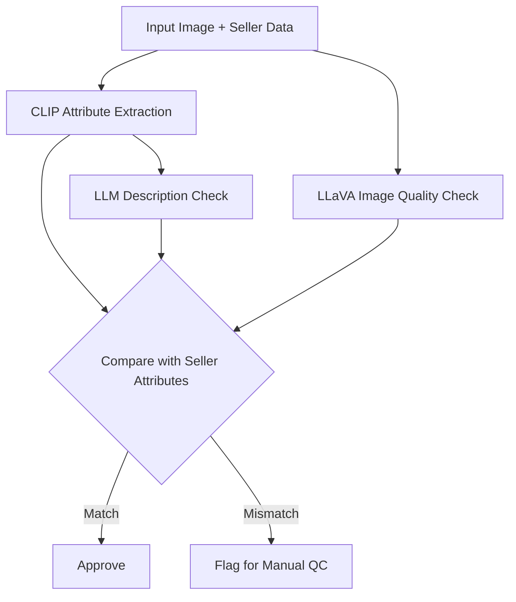

# Meesho DICE 2.0: Vision-based Product Quality Control  
*Comprehensive Documentation & User Guide*  

Welcome to the **DICE 2.0** documentation. This system ensures high-quality product listings on Meesho by leveraging state-of-the-art vision, language, and reasoning models to detect listing mismatches, fraudulent claims, and poor-quality images. Below you'll find detailed guides for each module and sample usage patterns.

---

## 🏗️ System Overview

DICE 2.0 is a modular pipeline that:
- **Enhances product images** for clarity.
- **Extracts product attributes** (like color, category) directly from images.
- **Compares extracted attributes** with seller-provided details.
- **Cross-verifies product descriptions** using AI-powered semantic matching.
- **Flags listings** for review if inconsistencies or low-quality images are detected.

The system is built on Hugging Face Transformers, OpenAI LLMs, and CLIP models.

---

## 📁 File-by-File Documentation

---

## `inference.py`

This is the **image quality inference script**. It uses a fine-tuned LLaVA model (with LoRA adapter) to evaluate a single image and suggest improvements.

### What It Does

- Loads a LLaVA vision-language model with PEFT LoRA adapter.
- Accepts an image, resizes it to 224x224 px.
- Prompts the model to identify quality issues, e.g., blur, lighting, framing.
- Prints suggestions for improving the image.

### Usage Example

```python
python inference.py
```

### Sample Output

```
The image is blurry and poorly lit; please retake with better lighting and focus.
```

### Key Code Flow

```python
from transformers import AutoProcessor, LlavaForConditionalGeneration
from peft import PeftModel
from PIL import Image

# Load model and processor
model_id = "llava-hf/llava-1.5-7b-hf"
processor = AutoProcessor.from_pretrained(model_id)
model = LlavaForConditionalGeneration.from_pretrained(model_id, ...)
model = PeftModel.from_pretrained(model, "checkpoint-3540/checkpoint-3540")
model = model.merge_and_unload()

# Prepare image and prompt
image = Image.open(image_path).convert("RGB").resize((224, 224))
prompt = "<image>\npoint out some problems related to the quality of image..."

# Run inference
inputs = processor(text=prompt, images=image, return_tensors="pt").to(model.device)
output = model.generate(**inputs, max_new_tokens=50)
generated_text = processor.decode(output[0], skip_special_tokens=True)
print(generated_text)
```

---

## `train.py`

This script is for **fine-tuning the LLaVA model** using LoRA (Low-Rank Adaptation) on a custom dataset of product images and label pairs.

### What It Does

- Loads labeled image+text data from `train_data_final.json`.
- Processes images and structures conversations for multi-modal fine-tuning.
- Applies LoRA on key transformer layers to make training efficient.
- Uses HuggingFace TRL's SFTTrainer for supervised finetuning.
- Saves checkpoints and logs during training.

### Key Features

- Supports 4-bit/8-bit quantization for efficient training.
- Trains on user-defined attributes and outputs.
- Configurable batch size, epochs, learning rate.

### Typical Training Loop

```python
python train.py
```

### Key Code Flow

```python
from transformers import AutoProcessor, LlavaForConditionalGeneration
from peft import LoraConfig, get_peft_model
from trl import SFTTrainer, SFTConfig
from datasets import Dataset

# Load and process data
with open("train_data_final.json") as f:
    raw_data = json.load(f)
# Build messages list with image and text

dataset = Dataset.from_list(processed_data)

# Load model and processor
model = LlavaForConditionalGeneration.from_pretrained(model_id, ...)
peft_config = LoraConfig(...)
model = get_peft_model(model, peft_config)

# Set up trainer
sft_config = SFTConfig(...)
trainer = SFTTrainer(model=model, train_dataset=dataset, peft_config=peft_config, args=sft_config, processing_class=processor)

# Train!
trainer.train()
```

---

## `app.py`

This file is **empty** and acts as a placeholder for the web or API frontend application.  
**Recommendation:** Use this file to build a REST API or Streamlit/Gradio/UI app that calls the pipeline.

---

## `pipline.py`

This is the **core pipeline module**. It orchestrates the entire workflow from image processing, attribute extraction, attribute comparison, and description validation.

### Key Features

- Loads and caches CLIP and LLaVA models.
- Extracts attributes from images using CLIP zero-shot classification.
- Compares image attributes to seller-entered attributes.
- Uses OpenAI LLM to match seller attributes with description.
- Runs the full pipeline for a product in one call.

### Core Functions

- `clip_zero_shot_image_attributes(image, candidates, top_k)`
    - Extracts best-match attribute labels using CLIP.
- `compare_image_seller(image_path, seller_attrs)`
    - Compares image-inferred and seller attributes; flags mismatches.
- `image_enhanccer_tool(image_path)`
    - Returns LLaVA-powered image quality suggestions.
- `compare_seller_description(seller_attrs, description)`
    - Uses GPT-4o to check for mismatches between structured attributes and free-text description.
- `full_pipeline(image_path, seller_attrs, seller_description)`
    - Runs all checks and returns comprehensive results.

### Pipeline Diagram



### Example Usage

```python
if __name__ == "__main__":
    seller_input = {...}
    desc = "This is a beige shirt..."
    result = full_pipeline("bba8b_512.jpg", seller_input, desc)
    print(result)
```

### Example Output

```json
{
  "image_vs_seller": {
    "img_top_attributes": {"color": "Grey Melange", ...},
    "mismatched_attributes": ["color"],
    "flagged": true
  },
  "seller_vs_description": {
    "match": false,
    "mismatched_attributes": ["Pockets"],
    "reason": "Seller said no pockets, description mentions 4 pockets"
  },
  "image_enhancement_suggestions": "Image is blurry, please recapture with better lighting."
}
```

---

## `clip.py`

This is a **utility module for CLIP-based attribute extraction and seller match flagging**.

### What It Does

- Loads OpenAI's CLIP model and processor.
- Provides a zero-shot classifier for product attributes: category, color, sleeve, pockets.
- Compares extracted image attributes with seller data.
- Flags items if mismatch ratio exceeds a threshold.
- Intended for batch or API use.

### Function Highlights

- `load_models()`
    - Loads and caches the CLIP model for fast inference.
- `clip_zero_shot_image_attributes(image, candidates, top_k)`
    - Returns top-k probable attribute values for each attribute group.
- `match_and_flag(image_path, seller_attrs, candidates, flag_threshold)`
    - Returns a detailed report: extracted attributes, comparison table, flagging decision.

### Typical Use

```python
from clip import match_and_flag, load_models
load_models()
result = match_and_flag("sample.jpg", {"category": "shirt", "color": "Beige", ...})
print(result)
```

### Sample Output

```json
{
  "image_path": "sample.jpg",
  "img_top_attributes": {"category": "shirt", "color": "Grey Melange", ...},
  "comparisons": {
    "category": {"img_label": "shirt", "seller_label": "shirt", "match": true},
    "color": {"img_label": "Grey Melange", "seller_label": "Beige", "match": false}
  },
  "mismatch_ratio": 0.25,
  "flagged": false
}
```

---

## `agent.py`

This file showcases how to use **OpenAI's GPT-4o (via Azure API)** to semantically compare vision-extracted product attributes with the seller's free-form product description.

### What It Does

- Defines a strict system prompt for attribute–description consistency checking.
- Calls the OpenAI (Azure) chat completion API.
- Returns a **JSON object** summarizing:
    - Whether all attributes match.
    - Which attributes mismatch (if any).
    - Human-readable reason.

### Usage Example

Set your `api_key` and `azure_endpoint`. Then run:

```python
python agent.py
```

### Sample Output

```json
{
  "match": false,
  "mismatched_attributes": ["Blouse"],
  "reason": "Vision agent says 'No Blouse', description mentions 'matching unstitched blouse piece'"
}
```

---

## 🛠️ API Endpoints

> _Note: `app.py` is currently empty. These endpoints are suggestions if API is built._

### Example: `/pipeline`

```api
{
    "title": "Run Full Product QC Pipeline",
    "description": "Checks image quality, attribute matches, and description consistency.",
    "method": "POST",
    "baseUrl": "https://your-deployment-url.com",
    "endpoint": "/pipeline",
    "headers": [
        {
            "key": "Authorization",
            "value": "Bearer <token>",
            "required": false
        }
    ],
    "bodyType": "json",
    "requestBody": "{\n  \"image_path\": \"string\",\n  \"seller_attrs\": {\"category\": \"shirt\", \"color\": \"Beige\"},\n  \"seller_description\": \"string\"\n}",
    "responses": {
        "200": {
            "description": "QC Results",
            "body": "{\n  \"image_vs_seller\": {...},\n  \"seller_vs_description\": {...},\n  \"image_enhancement_suggestions\": \"...\"\n}"
        }
    }
}
```

---

## ⚙️ Installation

All modules require Python 3.8+, PyTorch, Transformers, HuggingFace datasets, PIL, OpenAI, and TRL.

```packagemanagers
{
    "commands": {
        "npm": "npm install openai",
        "yarn": "yarn add openai", 
        "pnpm": "pnpm add openai",
        "bun": "bun add openai"
    }
}
```

_Python users_:  
```bash
pip install -r requirements.txt
```

---


